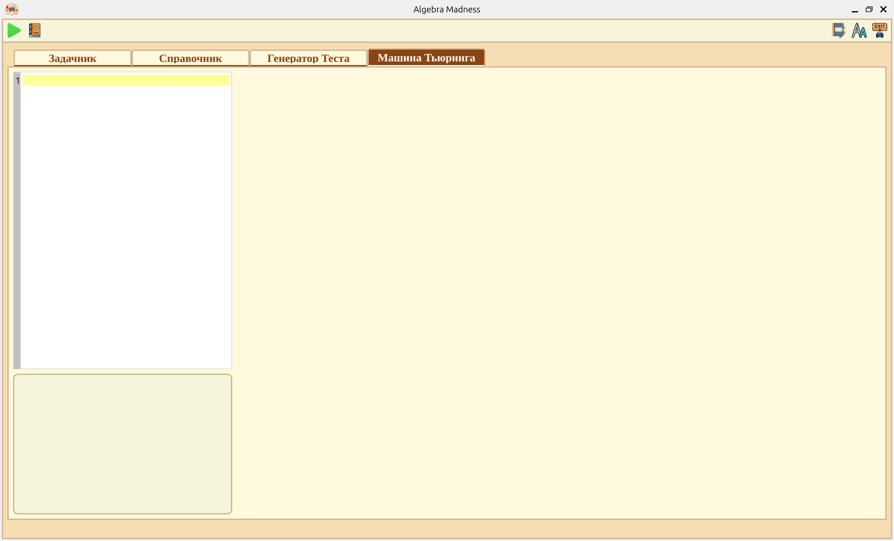
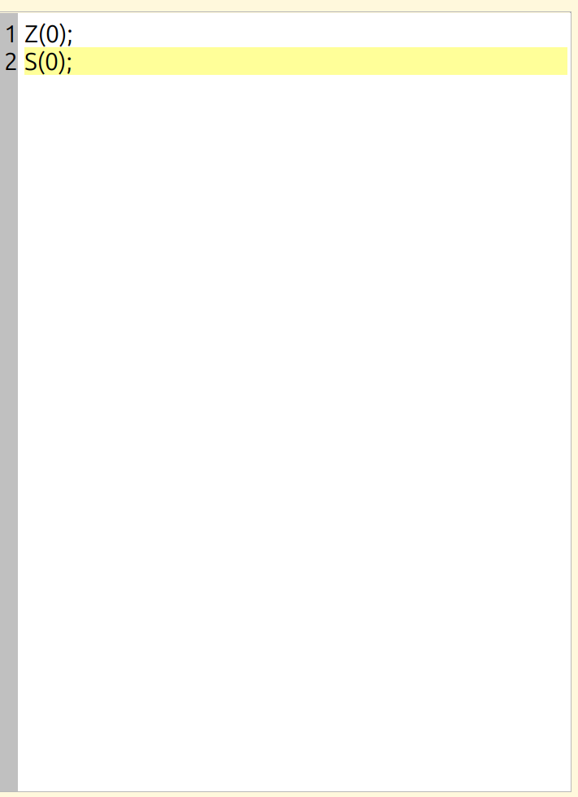
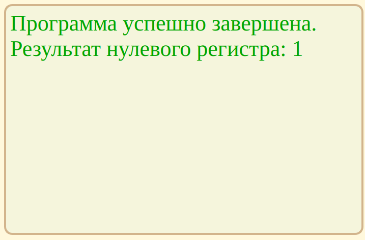

# Эмуляция работы машины с неограниченными регистрами
## Базовые понятия

Данный раздел расположен в меню *"Машина Тьюринга"*. При нажатии на него, откроется **начальное окно**:

Раздел состоит из:
- Редактора кода;
- Области для отладки;
- Визуализации команд;

## Редактор кода
Эмуляция команд *машины с неограниченными регистрами* (далее **МНР**) вопсроизводится с помощью интуитивно-понятного программного кода. Область для записи команд:

Перечень команд:
1. **Z** - обнуление регистру. Синтаксис:

        ...
        Z(№ регистра);
        ...

2. **S** - прибавление 1 к регистру. Синтаксис:

        ...
        S(№ регистра);
        ...

3. **T** - присвоение значения второму регистру, значением из первого. Синтаксис:

        ...
        T(№ регистра, № регистра);
        ...

4. **J** - сравнение значений регистров. При равенстве значений переход к команде под некоторым номером. Синтаксис:

        ...
        J(№ регистра, № регистра, № команды);
        ...

После каждой команды обязательным условием является постановка точки с запятой, без нее код будет считаться ошибочным и не выполнится.

Результатом работы программы является значение первого регистра.

При использовании команды **J**, номером команды - называется число, численно равное порядку выполнения команды.
Например, рассмотрим программу:

    Z(0);Z(1);
    S(1);S(0);
    J(0,1,1);

Данная программа реализует бесконечный цикл, где **J** продолжает выполнение команды всегда с команды номер 1, которая, в данном случае, есть - *Z(0)*.

## Отладка
Для того, чтобы узнать результат программы, успешность ее выполнения реализована - *область отладки*. Также благодаря ей, можно выявить ошибки синтаксиса.

## Визуализация МНР
Для более удобного и информативного понимания о выполнении различных команд МНР используется так называемая область *визуализации*. С ее помощью, можно отслеживать процесс выполнения программы и оценивать корректность используемых команд и логики выполнения программы.

## Доступные опции
В строке действий можно увидеть два действия: выполнить написанный код, а также открыть данную справку.

